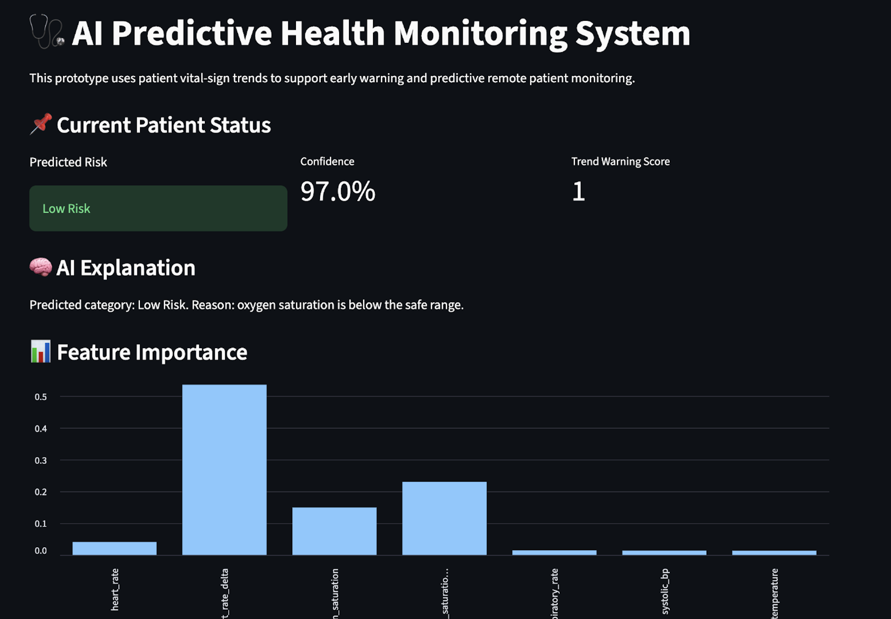

# 🩺 AI Predictive Health Monitoring System

An end-to-end machine learning system that predicts patient health risk using vital sign trends and presents insights through an interactive dashboard.

This project demonstrates how AI can be used for early warning systems in healthcare by analysing time-series patient data and generating explainable risk predictions.

---

## 🚀 Key Features

- 📊 **Synthetic Patient Data Generation**
  - Simulates real-world vital signs (heart rate, oxygen, temperature, etc.)
  
- 📈 **Trend-Based Feature Engineering**
  - Delta features (change over time)
  - Trend warning scores for early risk detection

- 🤖 **Machine Learning Model**
  - Random Forest Classifier for multi-class risk prediction
  - Balanced and realistic evaluation metrics

- 🧠 **Explainable AI Insights**
  - Feature importance visualization
  - Human-readable reasoning for predictions

- 🌐 **Interactive Dashboard (Streamlit)**
  - Real-time patient selection
  - Risk prediction + confidence
  - Time-series visualisation of vitals

---

## 🧠 Problem Statement

Healthcare systems require early detection of patient deterioration.  
This project simulates a **predictive monitoring system** that:

- Detects abnormal trends in patient vitals  
- Classifies patients into risk categories  
- Provides interpretable insights for decision support  

---

## 🏗️ Project Architecture

Data Generation → Feature Engineering → Model Training → Prediction → Dashboard

ai-predictive-health-monitoring-system/
│
├── app/
│   └── health_dashboard.py
│
├── src/
│   ├── generate_patient_data.py
│   ├── trend_analysis.py
│   └── train_model.py
│
├── data/
│   ├── raw/
│   │   └── patient_vitals.csv
│   └── processed/
│       └── patient_vitals_processed.csv
│
├── models/
│   └── risk_model.pkl
│
├── images/
│   └── feature_importance.png
│
├── notebooks/
│
├── requirements.txt
├── README.md
└── .gitignore

---

## 📊 Demo

---

## ⚙️ Tech Stack

- **Python**
- **Pandas / NumPy** – Data processing  
- **Scikit-learn** – Machine learning  
- **Matplotlib / Seaborn** – Visualisation  
- **Streamlit** – Interactive dashboard  

---

## 🧪 Model Details

- **Algorithm:** Random Forest Classifier  
- **Input Features:**
  - Vital signs (heart rate, oxygen saturation, temperature, respiratory rate, BP)
  - Delta features (change over time)
  - Trend warning score

- **Output:**
  - Risk category (Low / Moderate / High)
  - Confidence score
  - Explanation

---

## ▶️ How to Run the Project

Make sure you have Python 3.9+ installed.

1. Clone the repository  
git clone https://github.com/Kushs22/ai-predictive-health-monitoring-system.git  
cd ai-predictive-health-monitoring-system  

2. Install dependencies  
pip install -r requirements.txt  

3. Generate dataset  
python src/generate_patient_data.py  

4. Run feature engineering  
python src/trend_analysis.py  

5. Train the model  
python src/train_model.py  

6. Launch dashboard  
streamlit run app/health_dashboard.py  
